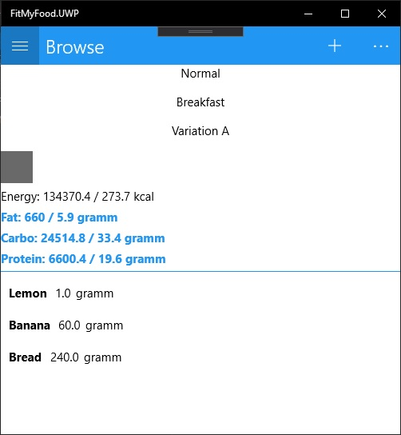
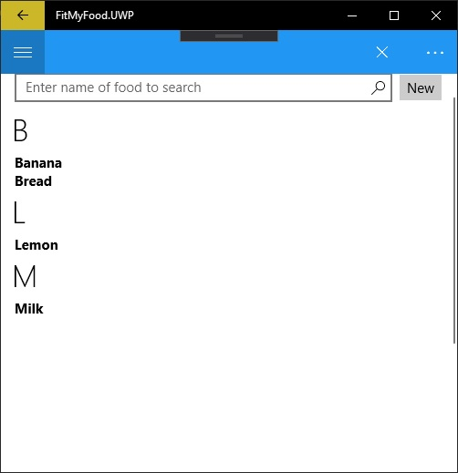
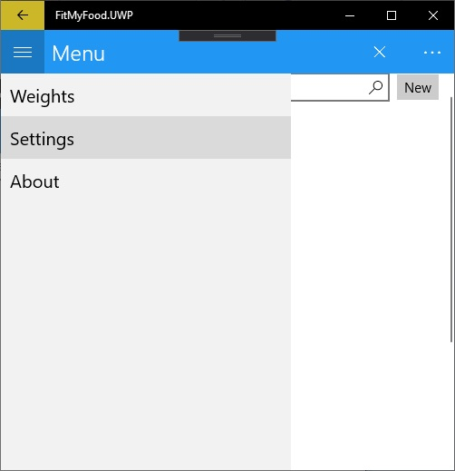
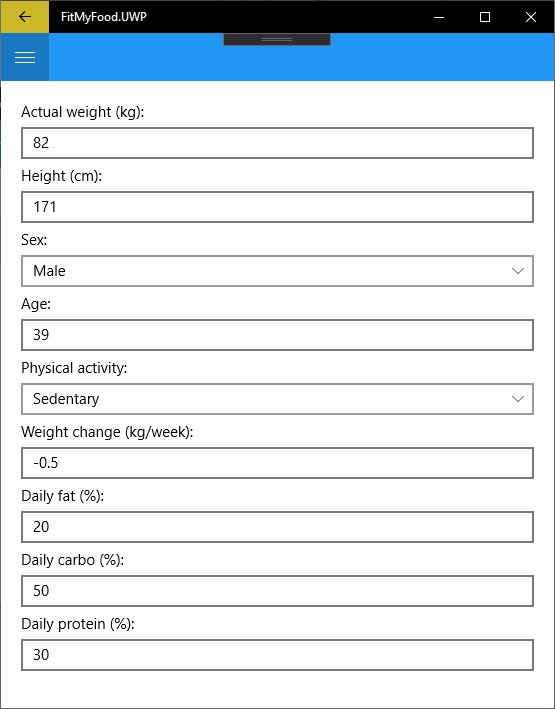

# About
Xamarin app to create daily food plans, meal variations by calculating the calories and nutritients (carbo, fat, protein). Automatically calculates quantity of new item to fit into the daily kalorie and nutritient plans.

